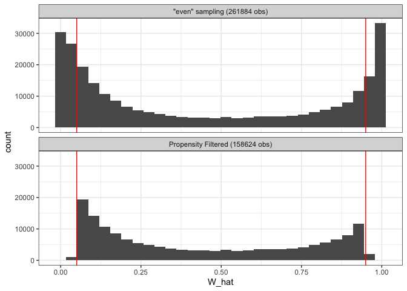
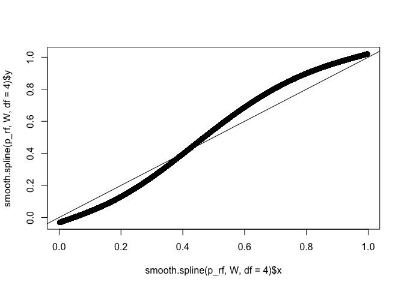
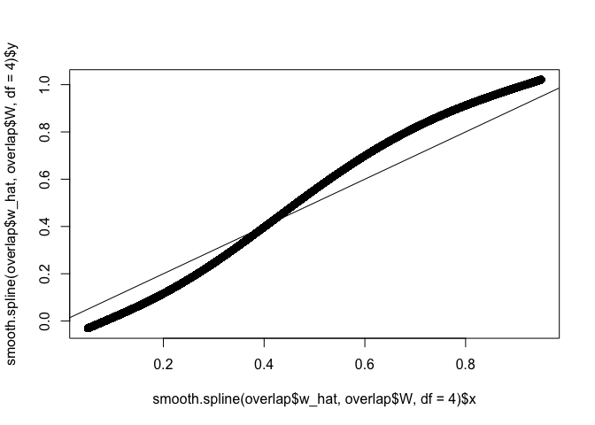
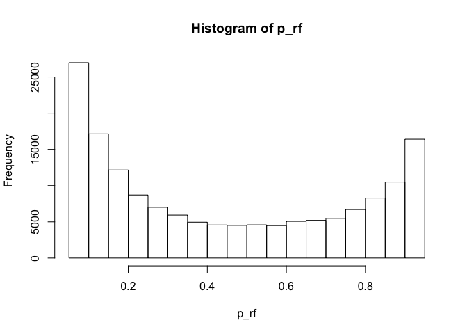
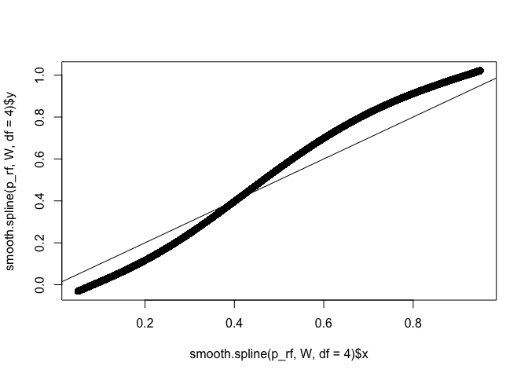
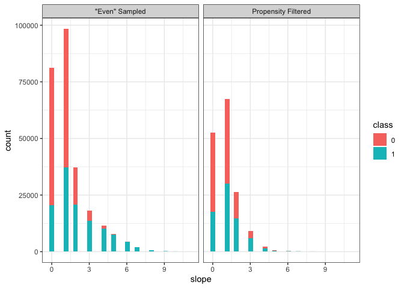
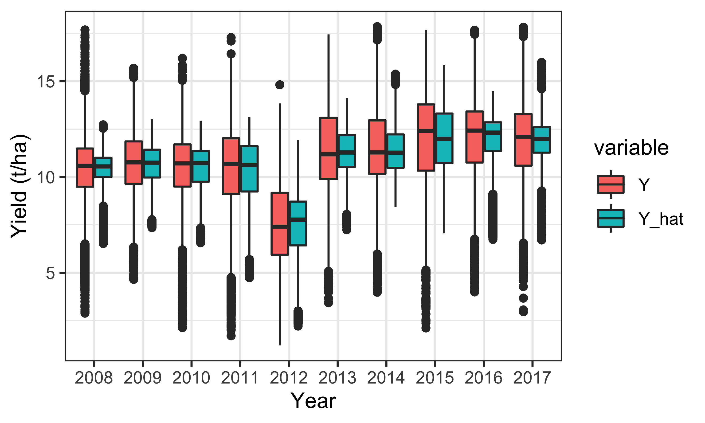
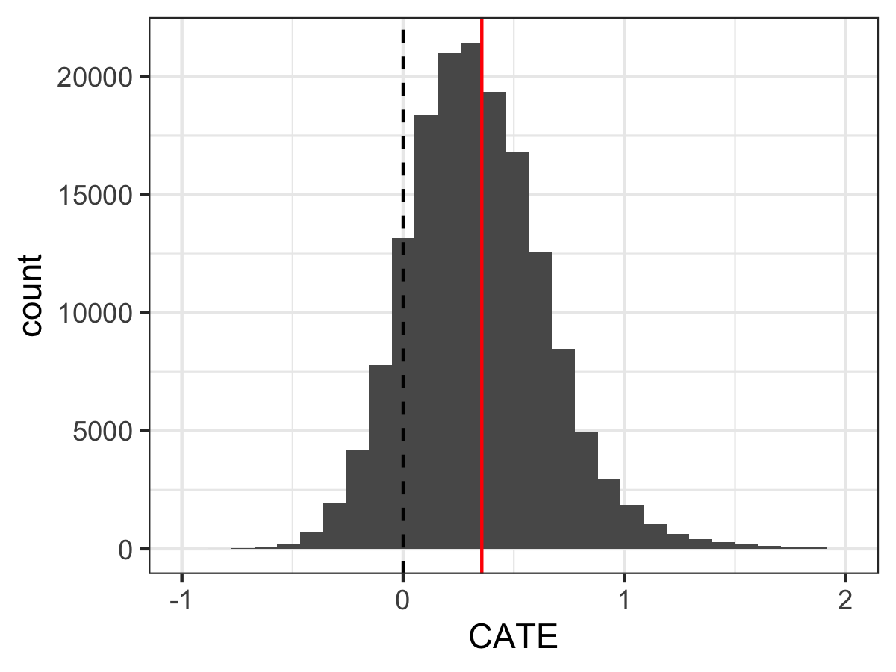
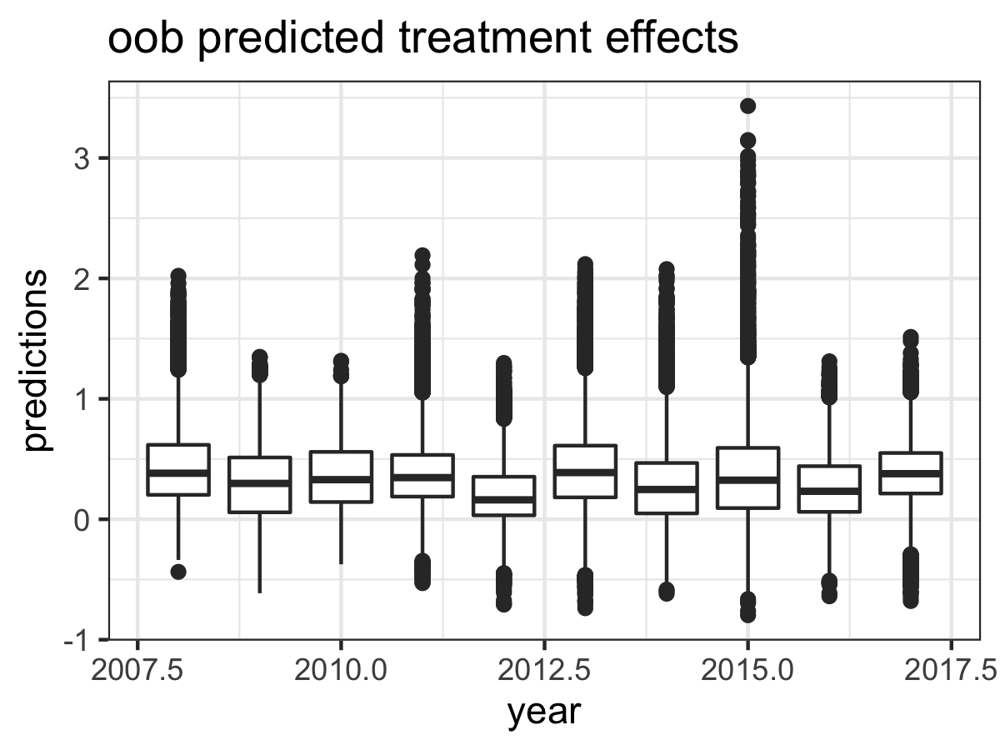
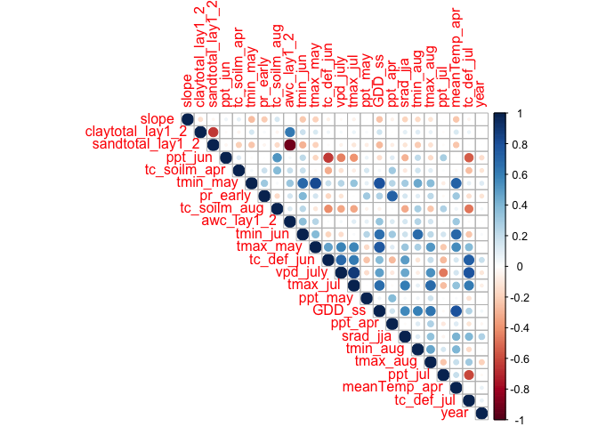

Goal: Implement a causal forest from the `grf` package as a way to compare the effect of high/low till in light of potential confoundedness from field selection bias - if certain fields are low till for a reason.

Data: field-based long-term data. Here, I sample up to 500 points for each ted (climate soil domains) and tillstatus-year from all available samples (to reduce computational burden and even up samples) and then toss out points with high/low propensities.

Notes: 

* Many causal forest routines take some time to run (up to a few hours), so this script exports intermediate model results as R Data objects (*.rds) for subsequent use/analysis
* due to randomness inherent in random forest routines, rexact esults are unlikely to be reproduced


**R Packages Needed**


```r
library(tidyverse)
library(grf)
library(RColorBrewer)
library(earth)
library(corrplot)
library(car)
library(aod)
library(sf)

library(here)

sessionInfo()
```

```
## R version 3.5.1 (2018-07-02)
## Platform: x86_64-apple-darwin15.6.0 (64-bit)
## Running under: macOS  10.14
## 
## Matrix products: default
## BLAS: /Library/Frameworks/R.framework/Versions/3.5/Resources/lib/libRblas.0.dylib
## LAPACK: /Library/Frameworks/R.framework/Versions/3.5/Resources/lib/libRlapack.dylib
## 
## locale:
## [1] en_US.UTF-8/en_US.UTF-8/en_US.UTF-8/C/en_US.UTF-8/en_US.UTF-8
## 
## attached base packages:
## [1] stats     graphics  grDevices utils     datasets  methods   base     
## 
## other attached packages:
##  [1] here_0.1           sf_0.7-4           aod_1.3.1         
##  [4] car_3.0-2          carData_3.0-2      corrplot_0.84     
##  [7] earth_4.7.0        plotmo_3.5.2       TeachingDemos_2.10
## [10] plotrix_3.7-4      RColorBrewer_1.1-2 grf_0.10.2        
## [13] forcats_0.3.0      stringr_1.3.1      dplyr_0.8.0.1     
## [16] purrr_0.2.5        readr_1.1.1        tidyr_0.8.1       
## [19] tibble_2.0.1       ggplot2_3.2.0      tidyverse_1.2.1   
## [22] knitr_1.20        
## 
## loaded via a namespace (and not attached):
##  [1] Rcpp_1.0.0        lubridate_1.7.4   lattice_0.20-35  
##  [4] class_7.3-14      assertthat_0.2.0  rprojroot_1.3-2  
##  [7] digest_0.6.16     R6_2.2.2          cellranger_1.1.0 
## [10] backports_1.1.2   e1071_1.7-0       evaluate_0.11    
## [13] httr_1.3.1        pillar_1.3.1      rlang_0.3.1      
## [16] lazyeval_0.2.1    curl_3.3          readxl_1.1.0     
## [19] rstudioapi_0.7    data.table_1.11.4 Matrix_1.2-14    
## [22] rmarkdown_1.10    foreign_0.8-70    munsell_0.5.0    
## [25] broom_0.5.0       compiler_3.5.1    modelr_0.1.2     
## [28] pkgconfig_2.0.2   htmltools_0.3.6   tidyselect_0.2.5 
## [31] rio_0.5.16        crayon_1.3.4      withr_2.1.2      
## [34] grid_3.5.1        spData_0.2.9.3    DBI_1.0.0        
## [37] nlme_3.1-137      jsonlite_1.6      gtable_0.2.0     
## [40] magrittr_1.5      units_0.6-1       scales_1.0.0     
## [43] zip_2.0.1         cli_1.0.1         stringi_1.2.4    
## [46] xml2_1.2.0        openxlsx_4.1.0    tools_3.5.1      
## [49] glue_1.3.0        hms_0.4.2         abind_1.4-5      
## [52] yaml_2.2.0        colorspace_1.3-2  classInt_0.2-3   
## [55] rvest_0.3.2       haven_1.1.2
```

**Directories**


```r
# input/cleaned data folder
dataFolder <- paste0(here::here(),'/data/tabular_field_data')
dataFileNameAll <- '/maize_longterm_fields_20190614.rds'

# output scratch folder for model output rdata objects
scratchFolder <- paste0(here::here(),'/data/model_output/causalForest_maize_Longterm')

# make scratch folder if necessary
dir.create(file.path(scratchFolder), showWarnings = FALSE)
```

# Load and Sample Data

## load and clean


```r
# all cleaned data
tillYears <- readRDS(paste0(dataFolder,dataFileNameAll)) 

# combine some variables, remove reduncancies
tillYears2 <- tillYears %>% 
  mutate(awc_lay1_2 = awc_lay1 + awc_lay2,
         sandtotal_lay1_2 = (sandtotal_r_lay1 + sandtotal_r_lay2)/2,
         claytotal_lay1_2 = (claytotal_r_lay1 + claytotal_r_lay2)/2,
         silttotal_lay1_2 = 100 - sandtotal_lay1_2 - claytotal_lay1_2,
         ksat_lay1_2 = (ksat_lay1 + ksat_lay2)/2) %>%
  dplyr::select(-c(contains('_r_'),
                   awc_lay1, awc_lay2, ksat_lay1, ksat_lay2))

# clean outliers from SCYM
summary(tillYears2$yield_tha)
```

```
##    Min. 1st Qu.  Median    Mean 3rd Qu.    Max. 
##   0.108   9.622  10.940  10.864  12.659  29.259
```

```r
cleanQ <- quantile(tillYears2$yield_tha, probs = c(0.0001, 0.9999), na.rm=TRUE)
cleanQ
```

```
##     0.01%    99.99% 
##  1.175371 17.850507
```

```r
# remove outliers: 
tillYearsAll <- tillYears2 %>%
  ungroup() %>%
  filter(yield_tha > cleanQ[1]) %>%
  filter(yield_tha < cleanQ[2]) %>%
  tidyr::drop_na() %>%
  mutate(uniqueID = row_number())

length(unique(tillYearsAll$pointID))      
```

```
## [1] 159704
```

```r
tillYearsAllConstant <- tillYearsAll %>%  filter(tillStatus == 'constant_high') 
length(unique(tillYearsAllConstant$pointID)) 
```

```
## [1] 77421
```

```r
tillYearsAllConstantLow <- tillYearsAll %>%  filter(tillStatus == 'constant_low') 
length(unique(tillYearsAllConstantLow$pointID)) 
```

```
## [1] 82283
```

```r
table(tillYearsAll$tillStatus)
```

```
## 
## constant_high  constant_low 
##        317279        350720
```

## make sample - all
sample more evenly across teds - set maximum samples per ted to reduce dataset set in a more balanced way

W = treatment status (1 = conservation tillage)


```r
# treatment converter key
binary <- data.frame(tillStatus = c('constant_high','constant_low'),
                     W = c(0,1))

tillYearsAll2 <- tillYearsAll %>%
  left_join(binary) %>%
  rename(Y = yield_tha)
```

```
## Joining, by = "tillStatus"
```

```
## Warning: Column `tillStatus` joining character vector and factor, coercing
## into character vector
```

```r
# extract balanced thing for training
samples_per_group <- 500
set.seed(5)
constantLess <- tillYearsAll2 %>%
  na.omit() %>%
  group_by(ted, tillStatus, year) %>%
  sample_n(., size = min(samples_per_group, n()), replace = FALSE) %>%
  ungroup() %>%
  mutate(year = as.integer(year))

table(constantLess$tillStatus)
```

```
## 
## constant_high  constant_low 
##        144127        117757
```

```r
table(constantLess$year)
```

```
## 
##  2008  2009  2010  2011  2012  2013  2014  2015  2016  2017 
## 24655 27652 23843 28639 23077 29183 23277 28740 23111 29707
```

```r
table(constantLess[,c('tillStatus','year')])
```

```
##                year
## tillStatus       2008  2009  2010  2011  2012  2013  2014  2015  2016
##   constant_high 13493 15090 12845 15691 12874 16036 12618 15994 12860
##   constant_low  11162 12562 10998 12948 10203 13147 10659 12746 10251
##                year
## tillStatus       2017
##   constant_high 16626
##   constant_low  13081
```

```r
table(tillYearsAll2$tillStatus)
```

```
## 
## constant_high  constant_low 
##        317279        350720
```

```r
# how many repeat points
nrow(constantLess)
```

```
## [1] 261884
```

```r
sum(duplicated(constantLess$pointID))
```

```
## [1] 152796
```

```r
length(unique(constantLess$pointID))
```

```
## [1] 109088
```

most fields are in this dataset 2-3 times in different years


# Causal forests

## Propensity scores
using soil and normals - static variables

The overlap assumption is violated with propensities very near 0 and 1, so remove data when W.hat < 0.05 and W.hat > 0.95


```r
# covariates: climate normals and soil variables
X_norm <- constantLess %>%
  select(c(contains('norm'), contains('lay1'), 'slope'))

# treatment
W <- constantLess %>% dplyr::pull(W)

# run
W_forest <- grf::regression_forest(X_norm, W, num.trees = 2000)
W_hat <- predict(W_forest)$predictions

WvarImp <- W_forest %>% 
  variable_importance() %>% 
  as.data.frame() %>% 
  mutate(variable = colnames(W_forest$X.orig)) %>% 
  arrange(desc(V1))

# check propensity scores
p_rf = W_hat
hist(p_rf)

sum(p_rf == 0)
min(p_rf)
sum(p_rf < .005)

sum(p_rf == 1)
max(p_rf)
sum(p_rf > .995)

{plot(smooth.spline(p_rf, W, df = 4))
abline(0, 1)}

# save intermediates
saveRDS(constantLess, paste0(scratchFolder, '/constantLess.rds'))
saveRDS(W_forest, paste0(scratchFolder, '/W_forest.rds'))
saveRDS(W_hat, paste0(scratchFolder, '/W_hat.rds'))
saveRDS(WvarImp, paste0(scratchFolder, '/W_forest_varImp.rds'))
```

## Prune Samples
Toss out rows with excessively high/low propensities

### Compare Propensity Filters


```r
# re-load so chunk runs in markdown output
constantLess <- readRDS(paste0(scratchFolder, '/constantLess.rds'))
W_hat <- readRDS(paste0(scratchFolder, '/W_hat.rds'))
W <- constantLess %>% dplyr::pull(W)
p_rf = W_hat

# filter it
overlap0 <- constantLess %>%
  mutate(w_hat = W_hat) %>%
  mutate(keep = case_when(w_hat < 0.05 | w_hat > 0.95 ~ 0,
                        w_hat >= 0.05 | w_hat <= 0.95  ~ 1))
overlap <- overlap0 %>% filter(keep == 1)
nrow(overlap0) - nrow(overlap)
```

```
## [1] 103260
```

```r
nrow(overlap)
```

```
## [1] 158624
```

```r
table(overlap$tillStatus)
```

```
## 
## constant_high  constant_low 
##         88220         70404
```

```r
table(overlap$year)
```

```
## 
##  2008  2009  2010  2011  2012  2013  2014  2015  2016  2017 
## 15000 16819 14748 17235 13823 17645 14449 17135 14125 17645
```

```r
table(overlap[,c('tillStatus','year')])
```

```
##                year
## tillStatus      2008 2009 2010 2011 2012 2013 2014 2015 2016 2017
##   constant_high 8565 8964 8434 9251 8056 9426 8279 9406 8165 9674
##   constant_low  6435 7855 6314 7984 5767 8219 6170 7729 5960 7971
```

```r
# compare remaining teds
unique(constantLess$ted)
```

```
##   [1] 102403 102503 102603 102703 103303 103403 103503 103603 103703 104403
##  [11] 104603 104803 105703 201403 201503 202403 202503 202603 202703 203303
##  [21] 203403 203503 203603 203703 203803 204403 204503 204603 204803 205703
##  [31] 301403 301503 302303 302403 302503 302603 302703 303203 303303 303403
##  [41] 303503 303603 303703 303803 304403 304503 304603 304803 305703 305803
##  [51] 401403 402303 402403 402503 402603 402703 403203 403303 403403 403503
##  [61] 403603 403703 403803 404403 404503 404603 404803 405603 405703 405803
##  [71] 454803 501403 501503 502203 502303 502403 502503 502603 502703 503203
##  [81] 503303 503403 503503 503603 503703 503803 504403 504503 504603 504803
##  [91] 505703 505803 553603 601403 601503 602203 602303 602403 602503 602603
## [101] 602703 603203 603303 603403 603503 603603 603703 603803 604403 604503
## [111] 604603 604803 605703 605803 702403 702503 702603 702703 703203 703303
## [121] 703403 703503 703603 703703 703803 704403 704503 704603 704803 705703
## [131] 705803
```

```r
unique(overlap$ted)
```

```
##   [1] 102603 102703 103303 103403 103503 103603 103703 104603 104803 105703
##  [11] 202503 202603 202703 203303 203403 203503 203603 203703 203803 204403
##  [21] 204503 204603 204803 205703 302303 302403 302503 302603 302703 303203
##  [31] 303303 303403 303503 303603 303703 303803 304403 304503 304603 304803
##  [41] 305703 402303 402503 402603 402703 403203 403303 403403 403503 403603
##  [51] 403703 403803 404403 404503 404603 404803 405603 405703 405803 502203
##  [61] 502303 502403 502503 502603 502703 503303 503403 503503 503603 503703
##  [71] 503803 504403 504503 504603 504803 505703 602203 602303 602403 602503
##  [81] 602603 602703 603203 603303 603403 603503 603603 603703 603803 604403
##  [91] 604503 604603 604803 605703 605803 702403 702503 702603 702703 703203
## [101] 703303 703403 703503 703603 703703 703803 704403 704503 704603 704803
## [111] 705703
```

```r
both <- data.frame(W_hat = W_hat,
                   type = paste0('"even" sampling (',nrow(constantLess), ' obs)')) %>%
  bind_rows(data.frame(W_hat = overlap$w_hat,
                       type = paste0('Propensity Filtered (', nrow(overlap), ' obs)')))
```

```
## Warning in bind_rows_(x, .id): Unequal factor levels: coercing to character
```

```
## Warning in bind_rows_(x, .id): binding character and factor vector,
## coercing into character vector

## Warning in bind_rows_(x, .id): binding character and factor vector,
## coercing into character vector
```

```r
ggplot(both,
       aes(x = W_hat)) +
  geom_histogram() +
  geom_vline(xintercept = 0.05, col='red') +
  geom_vline(xintercept = 0.95, col = 'red') +
  facet_wrap(~type, nrow = 2) +
  theme_bw()
```

```
## `stat_bin()` using `bins = 30`. Pick better value with `binwidth`.
```

<!-- -->

```r
{plot(smooth.spline(p_rf, W, df = 4))
abline(0, 1)}
```

<!-- -->

```r
{plot(smooth.spline(overlap$w_hat, overlap$W, df = 4))
abline(0, 1)}
```

<!-- -->

```r
# save overlap data!
saveRDS(overlap, paste0(scratchFolder, '/overlap.rds'))
```


## expected outcome: Y.hat
i guess do this individually too? on overlapped data

### Pick covars


```r
overlap <- readRDS(paste0(scratchFolder, '/overlap.rds'))

# pick subset of variables by dropping stuff: candidate 1
X_c1 <- overlap %>%
  select(-c(pointID, fips, pxCount, nObs, W, uniqueID,
            contains('norm'), contains('ted')))

# mars for var selection
set.seed(5)
marsAll <- earth::earth(Y ~ ., data = X_c1, degree = 2)
summary(marsAll)
ev <- evimp(marsAll) # estimate variable importance
plot(ev)
ev

saveRDS(marsAll, paste0(scratchFolder, '/mars_c1.rds'))
```

### Train Yhat


```r
# variables from mars
marsAll <- readRDS(paste0(scratchFolder, '/mars_c1.rds'))
summary(marsAll)
ev <- evimp(marsAll) # estimate variable importance
plot(ev)
ev

envvars <- rownames(ev)


varsToKeep = c(envvars, 'srad_jja','GDD_ss')

X <- overlap %>%
  select(varsToKeep)

corr <- cor(X )
corrplot(corr, type = 'upper')

# outcome
Y <- overlap %>% dplyr::pull(Y)

Y_forest <- grf::regression_forest(X, Y, num.trees = 2000)

YvarImp <- Y_forest %>% 
  variable_importance() %>% 
  as.data.frame() %>% 
  mutate(variable = colnames(Y_forest$X.orig)) %>% 
  arrange(desc(V1))
YvarImp


Y_hat <- predict(Y_forest)$predictions

Ychecker <- data.frame(Y = Y,
                       Y_hat = Y_hat,
                       year = overlap$year)
Yagreement <- lm(Y~Y_hat)
summary(Yagreement)

ggplot(Ychecker, aes(x=Y, y = Y_hat)) +
  geom_hex() +
  scale_fill_gradientn(colors = brewer.pal(9,'YlGnBu')) +
  geom_smooth(method= 'lm') +
  coord_equal(xlim=c(0,18), ylim=c(0,18)) + 
  geom_abline(slope = 1, intercept = 0, linetype='dashed') + 
  facet_wrap(~year) +
  theme_bw()

saveRDS(Y_hat, paste0(scratchFolder, '/Y_hat.rds'))
saveRDS(Y_forest, paste0(scratchFolder, '/Y_forest.rds'))
saveRDS(YvarImp, paste0(scratchFolder, '/Y_forest_varImp.rds'))
```

## causal forest


```r
# reload overlap
overlap <- readRDS(paste0(scratchFolder, '/overlap.rds'))
Y_hat <- readRDS(paste0(scratchFolder, '/Y_hat.rds'))

# reload mars variables
marsAll <- readRDS(paste0(scratchFolder, '/mars_c1.rds'))
ev <- evimp(marsAll) # estimate variable importance
envvars <- rownames(ev)

# treatment
W <- overlap %>% dplyr::pull(W)
w_hat <- overlap$w_hat

# outcome
Y <- overlap %>% dplyr::pull(Y)

# make covariate list; 
# add in important propensity variables, and things i like (GDD), sherries impt var (tcsoilmapr)
varsToKeep_main = c(envvars,  'srad_jja',  'GDD_ss', 
                    'slope', 'meanTemp_apr', 'ppt_apr',  'vpd_july', # propense
                    'tc_soilm_apr', 'tc_def_jun'
              )

Xmain <- overlap %>%
  select(varsToKeep_main)

corr <- cor(Xmain )
corrplot(corr, type = 'upper')


cf <- grf::causal_forest(Xmain, Y, W, Y_hat, w_hat, num.trees = 2000)

ate_cf_aipw = average_treatment_effect(cf)
ate_cf_aipw = average_treatment_effect(cf, target.sample = 'overlap')
tauhat_rf_aipw = c(ATE=ate_cf_aipw["estimate"],
                   lower_ci=ate_cf_aipw["estimate"] - 1.96 * ate_cf_aipw["std.err"],
                   upper_ci=ate_cf_aipw["estimate"] + 1.96 * ate_cf_aipw["std.err"])
tauhat_rf_aipw

varImpMain <- cf %>% 
  variable_importance() %>% 
  as.data.frame() %>% 
  mutate(variable = colnames(cf$X.orig)) %>% 
  arrange(desc(V1))


saveRDS(cf, paste0(scratchFolder, '/cf_xc1.rds'))
saveRDS(varImpMain, paste0(scratchFolder, '/cf_xc1_varImp.rds'))
```


# Checking things out

reload rdata stuff


```r
overlap <- readRDS(paste0(scratchFolder, '/overlap.rds'))

# marsAll <- readRDS(paste0(scratchFolder, '/mars_c1.rds'))


#W_forest <- readRDS(paste0(scratchFolder, '/W_forest.rds'))
#W_hat <- readRDS(paste0(scratchFolder, '/W_hat.rds'))
W_hat <- overlap %>% dplyr::pull(w_hat)
WvarImp <- readRDS(paste0(scratchFolder, '/W_forest_varImp.rds'))

#Y_forest <- readRDS(paste0(scratchFolder, '/Y_forest.rds'))
Y_hat <- readRDS(paste0(scratchFolder, '/Y_hat.rds'))
YvarImp <- readRDS(paste0(scratchFolder, '/Y_forest_varImp.rds'))

cf <- readRDS(paste0(scratchFolder, '/cf_xc1.rds'))
varImp <- readRDS(paste0(scratchFolder, '/cf_xc1_varImp.rds'))

# covariates: climate normals and soil variables
X_norm <- overlap %>%
  select(c(contains('norm'), contains('lay1'), 'slope'))

# treatment
W <- overlap %>% dplyr::pull(W)
Y <- overlap %>% dplyr::pull(Y)

constantLess <- readRDS(paste0(scratchFolder, '/constantLess.rds'))
allWhat <- readRDS(paste0(scratchFolder, '/W_hat.rds'))

# process results ------------------------------
# add predicted treatment effects to data 
constOob_predict <- predict(cf)

# add hats to original data frame
overlapW0 <- overlap %>%
  bind_cols(data.frame(Y_hat = Y_hat))

colNormals <- names(X_norm)
colVars <- varImp %>% dplyr::pull(variable)

overlapW <- overlapW0 %>%
  mutate_at(colNormals, list(Q4n = ~ntile(., 4),
                           Q5n = ~ntile(., 5))) %>%
  mutate_at(colVars, list(Q4 = ~ntile(., 4),
                           Q5 = ~ntile(., 5)))

overlapTau <- overlapW %>%
  bind_cols(constOob_predict) 
```


## propensities


```r
# check propensity scores
p_rf = W_hat
hist(p_rf)
```

<!-- -->

```r
sum(p_rf == 0)
```

```
## [1] 0
```

```r
min(p_rf)
```

```
## [1] 0.05000475
```

```r
sum(p_rf < .005)
```

```
## [1] 0
```

```r
sum(p_rf == 1)
```

```
## [1] 0
```

```r
max(p_rf)
```

```
## [1] 0.9499904
```

```r
sum(p_rf > .995)
```

```
## [1] 0
```

```r
{plot(smooth.spline(p_rf, W, df = 4))
abline(0, 1)}
```

<!-- -->

```r
WvarImp
```

```
##              V1         variable
## 1  6.637277e-01            slope
## 2  1.564466e-01   pr_may_norm_mm
## 3  1.004723e-01  temp_apr_norm_C
## 4  2.741829e-02   pr_apr_norm_mm
## 5  2.470701e-02 vpd_jul_norm_hPa
## 6  5.606402e-03   pr_jun_norm_mm
## 7  5.535366e-03   pr_jul_norm_mm
## 8  5.416159e-03 vpd_jun_norm_hPa
## 9  1.834756e-03 sandtotal_lay1_2
## 10 1.579573e-03  temp_jun_norm_C
## 11 1.526524e-03 silttotal_lay1_2
## 12 1.514024e-03       awc_lay1_2
## 13 1.444207e-03  temp_may_norm_C
## 14 1.257927e-03  temp_aug_norm_C
## 15 1.215244e-03  temp_jul_norm_C
## 16 2.375000e-04 claytotal_lay1_2
## 17 6.036585e-05      ksat_lay1_2
```


### Compare slope ranges
does filtering by propensity reduce the range of slope values?


```r
both <- data.frame(slope = constantLess$slope,
                   type = '"Even" Sampled',
                   class = as.character(constantLess$W),
                   stringsAsFactors = FALSE) %>%
  bind_rows(data.frame(slope = overlap$slope,
                       type = 'Propensity Filtered',
                       class = as.character(overlap$W),
                       stringsAsFactors = FALSE))

ggplot(both,
       aes(x = slope, fill = class, group = class)) +
  geom_histogram() +
  facet_wrap(~type) +
  theme_bw()
```

```
## `stat_bin()` using `bins = 30`. Pick better value with `binwidth`.
```

<!-- -->

```r
nrow(constantLess)
```

```
## [1] 261884
```

```r
nrow(overlap)
```

```
## [1] 158624
```


## Outcome estimation Y hat


```r
YvarImp 
```

```
##              V1         variable
## 1  3.967524e-01         tmax_jul
## 2  3.003262e-01         tmax_may
## 3  8.676402e-02             year
## 4  5.366829e-02       tc_def_jul
## 5  3.742012e-02         srad_jja
## 6  3.510061e-02         tmax_aug
## 7  3.316646e-02         tmin_may
## 8  2.777683e-02          ppt_jun
## 9  1.051098e-02         pr_early
## 10 8.050915e-03     tc_soilm_aug
## 11 4.455488e-03         tmin_jun
## 12 2.017683e-03           GDD_ss
## 13 1.690244e-03          ppt_may
## 14 1.139939e-03          ppt_jul
## 15 7.597561e-04         tmin_aug
## 16 3.051829e-04 claytotal_lay1_2
## 17 5.487805e-05       awc_lay1_2
## 18 3.993902e-05 sandtotal_lay1_2
```

```r
Ychecker <- data.frame(Y = Y,
                       Y_hat = Y_hat,
                       year = overlap$year)
Yagreement <- lm(Y~Y_hat)
summary(Yagreement)
```

```
## 
## Call:
## lm(formula = Y ~ Y_hat)
## 
## Residuals:
##     Min      1Q  Median      3Q     Max 
## -8.5514 -0.8137  0.1156  0.9558  7.8197 
## 
## Coefficients:
##              Estimate Std. Error t value Pr(>|t|)    
## (Intercept) -0.714864   0.022694   -31.5   <2e-16 ***
## Y_hat        1.065858   0.002068   515.5   <2e-16 ***
## ---
## Signif. codes:  0 '***' 0.001 '**' 0.01 '*' 0.05 '.' 0.1 ' ' 1
## 
## Residual standard error: 1.48 on 158622 degrees of freedom
## Multiple R-squared:  0.6262,	Adjusted R-squared:  0.6262 
## F-statistic: 2.657e+05 on 1 and 158622 DF,  p-value: < 2.2e-16
```

```r
# yield year by year
YcheckerLong <- Ychecker %>%
  tidyr::gather(., key = variable, value = value, Y:Y_hat)


ggplot(YcheckerLong, aes(x=as.factor(year), y = value, group = interaction(year,variable), 
                         fill = variable)) +
  geom_boxplot() +
  theme_bw() +
  ylab('Yield (t/ha)') +
  xlab('Year')
```

<!-- -->


# average treatment effects

## variable importance


```r
varImp
```

```
##             V1         variable
## 1  0.569788503            slope
## 2  0.116445809 claytotal_lay1_2
## 3  0.064203206 sandtotal_lay1_2
## 4  0.028866873          ppt_jun
## 5  0.024494557     tc_soilm_apr
## 6  0.024198770         tmin_may
## 7  0.023610048         pr_early
## 8  0.021932028     tc_soilm_aug
## 9  0.021671434       awc_lay1_2
## 10 0.016354676         tmin_jun
## 11 0.014824426         tmax_may
## 12 0.014566173       tc_def_jun
## 13 0.010948785         vpd_july
## 14 0.005966015         tmax_jul
## 15 0.005354740          ppt_may
## 16 0.005336493           GDD_ss
## 17 0.005224078          ppt_apr
## 18 0.004713529         srad_jja
## 19 0.004640200         tmin_aug
## 20 0.004260092         tmax_aug
## 21 0.004207320          ppt_jul
## 22 0.003775930     meanTemp_apr
## 23 0.002520148       tc_def_jul
## 24 0.002096168             year
```


## ate
in t/ha


```r
ate_cf_aipw = average_treatment_effect(cf)
ate_cf_aipw = average_treatment_effect(cf)
tauhat_rf_aipw = c(ATE=ate_cf_aipw["estimate"],
                   lower_ci=ate_cf_aipw["estimate"] - 1.96 * ate_cf_aipw["std.err"],
                   upper_ci=ate_cf_aipw["estimate"] + 1.96 * ate_cf_aipw["std.err"])
tauhat_rf_aipw
```

```
##      ATE.estimate lower_ci.estimate upper_ci.estimate 
##         0.3551547         0.3377356         0.3725738
```

## plot  treatment effects


```r
ggplot(overlapTau,
       aes(x = predictions)) +
  geom_histogram() +
  xlim(-1,2)+
  xlab('CATE') +
  geom_vline(xintercept = 0, col = 'black', linetype = 'dashed') +
  geom_vline(xintercept = ate_cf_aipw["estimate"], col = 'red') +
  theme_bw()
```

```
## `stat_bin()` using `bins = 30`. Pick better value with `binwidth`.
```

```
## Warning: Removed 81 rows containing non-finite values (stat_bin).
```

```
## Warning: Removed 2 rows containing missing values (geom_bar).
```

<!-- -->

```r
ggplot(overlapTau,
       aes(x = year, y = predictions, group = year)) +
  geom_boxplot() +
  #facet_wrap(~W) +
  theme_bw() + ggtitle('oob predicted treatment effects')
```

<!-- -->

Interesting - treatment effects span 0! might have expected that

Note that the ate looks lower in 2012, but yield is also lower - looking at as a percentage might be better for that. overall fairly consistent across years

# HTE 
test for heterogeneous treatment effects? from Athey & Wagner preprint 2019


```r
# run best linear predictor analysis
calibration <- test_calibration(cf)
calibration
```

```
## 
## Best linear fit using forest predictions (on held-out data)
## as well as the mean forest prediction as regressors, along
## with heteroskedasticity-robust (HC3) SEs:
## 
##                                Estimate Std. Error t value  Pr(>|t|)    
## mean.forest.prediction         1.012803   0.034886  29.032 < 2.2e-16 ***
## differential.forest.prediction 1.361975   0.040972  33.242 < 2.2e-16 ***
## ---
## Signif. codes:  0 '***' 0.001 '**' 0.01 '*' 0.05 '.' 0.1 ' ' 1
```

heterogeneity! see Fig 2 and 3 code for heterogeneity breakdowns


## Variable correlations


```r
causalVars <- overlap %>% dplyr::select(varImp$variable)

corr <- cor(causalVars)
corrplot(corr, type = 'upper')
```

<!-- -->


