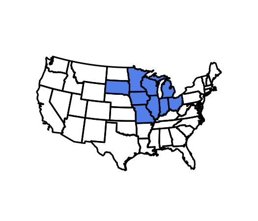
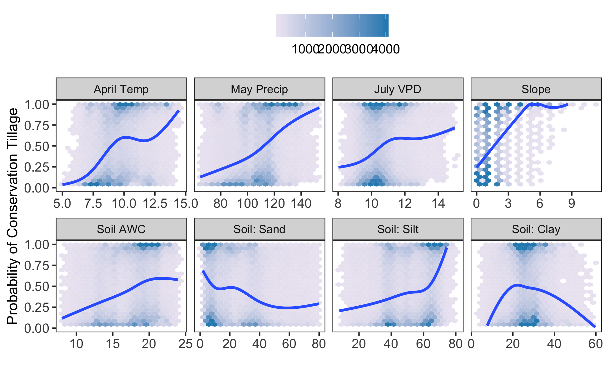

Goal: make Figure 1. Final multi-panel figure assembly done in Inkscape (not provided).

Note the map in Figure 1a is not included but available from the authors of Azzari et al. 2019 (https://www.sciencedirect.com/science/article/pii/S0034425718305157) upon reasonable request.


**R Packages Needed**


```r
library(tidyverse)
library(grf)
library(sf)
library(here)
library(raster)
library(latticeExtra)
library(RColorBrewer)
library(geofacet)

sessionInfo()
```

```
## R version 3.5.1 (2018-07-02)
## Platform: x86_64-apple-darwin15.6.0 (64-bit)
## Running under: macOS  10.14
## 
## Matrix products: default
## BLAS: /Library/Frameworks/R.framework/Versions/3.5/Resources/lib/libRblas.0.dylib
## LAPACK: /Library/Frameworks/R.framework/Versions/3.5/Resources/lib/libRlapack.dylib
## 
## locale:
## [1] en_US.UTF-8/en_US.UTF-8/en_US.UTF-8/C/en_US.UTF-8/en_US.UTF-8
## 
## attached base packages:
## [1] stats     graphics  grDevices utils     datasets  methods   base     
## 
## other attached packages:
##  [1] geofacet_0.1.9      latticeExtra_0.6-28 RColorBrewer_1.1-2 
##  [4] lattice_0.20-35     raster_2.6-7        sp_1.3-1           
##  [7] here_0.1            sf_0.7-4            grf_0.10.2         
## [10] forcats_0.3.0       stringr_1.3.1       dplyr_0.8.0.1      
## [13] purrr_0.2.5         readr_1.1.1         tidyr_0.8.1        
## [16] tibble_2.0.1        ggplot2_3.2.0       tidyverse_1.2.1    
## [19] knitr_1.20         
## 
## loaded via a namespace (and not attached):
##  [1] rnaturalearth_0.1.0 ggrepel_0.8.0       Rcpp_1.0.0         
##  [4] lubridate_1.7.4     png_0.1-7           class_7.3-14       
##  [7] assertthat_0.2.0    rprojroot_1.3-2     digest_0.6.16      
## [10] R6_2.2.2            cellranger_1.1.0    backports_1.1.2    
## [13] evaluate_0.11       e1071_1.7-0         httr_1.3.1         
## [16] pillar_1.3.1        rlang_0.3.1         lazyeval_0.2.1     
## [19] geogrid_0.1.0.1     readxl_1.1.0        rstudioapi_0.7     
## [22] Matrix_1.2-14       rmarkdown_1.10      munsell_0.5.0      
## [25] broom_0.5.0         compiler_3.5.1      modelr_0.1.2       
## [28] pkgconfig_2.0.2     imguR_1.0.3         rgeos_0.3-28       
## [31] htmltools_0.3.6     tidyselect_0.2.5    gridExtra_2.3      
## [34] crayon_1.3.4        withr_2.1.2         grid_3.5.1         
## [37] nlme_3.1-137        spData_0.2.9.3      jsonlite_1.6       
## [40] gtable_0.2.0        DBI_1.0.0           magrittr_1.5       
## [43] units_0.6-1         scales_1.0.0        cli_1.0.1          
## [46] stringi_1.2.4       xml2_1.2.0          tools_3.5.1        
## [49] glue_1.3.0          hms_0.4.2           jpeg_0.1-8         
## [52] yaml_2.2.0          colorspace_1.3-2    classInt_0.2-3     
## [55] rvest_0.3.2         haven_1.1.2
```

# Directories


```r
# scratch folder for model rdata objects: corn causal forest (produced in 01.00)
scratchFolder <- paste0(here::here(),'/data/model_output/causalForest_maize_Longterm')

# gis directory
gisFolder <- paste0(here::here(),'/data/gis')
```

# Reference inset map


```r
states <- read_sf(paste0(gisFolder, '/States_continental.shp')) %>%
  st_transform(5070) 

statesTill <- states %>%  dplyr::filter(STATE_ABBR %in%             c('SD','MN','IA','MO','IL','WI','IN','MI','OH'))

till_spdf <- as(statesTill, 'Spatial')
states_spdf <- as(states, 'Spatial')

plot(states[1], col = NA, reset = FALSE, main = NA)
plot(statesTill, col = 'cornflowerblue', add = TRUE)
```

```
## Warning in plot.sf(statesTill, col = "cornflowerblue", add = TRUE):
## ignoring all but the first attribute
```

<!-- -->


# Figure 1b: conditional probabilities of conservation tillage
treatment propensities on dataset prior to propensity filter - addresses the question "what factors are related to conservation tillage?"

treatment propensities from causal forest subroutine for corn 9 state region

## load causal forest: constant corn


```r
constantLess <- readRDS(paste0(scratchFolder, '/constantLess.rds'))
allWhat <- readRDS(paste0(scratchFolder, '/W_hat.rds'))
WvarImp <- readRDS(paste0(scratchFolder, '/W_forest_varImp.rds'))
```

## format data


```r
# add hats to original data frame
prop_all <- constantLess %>%
  bind_cols(data.frame(W_hat = allWhat))

# trim extreme values with few data points to avoid influencing GAM
trimmed <- prop_all %>%
  filter(vpd_jul_norm_hPa > 8 & vpd_jul_norm_hPa < 15,
         temp_apr_norm_C >5,
         awc_lay1_2 >8 & awc_lay1_2 < 24,
         silttotal_lay1_2 < 80,
         claytotal_lay1_2 <= 60,
         sandtotal_lay1_2 <= 80)

# Identify variables to highlight
WvarImp
```

```
##              V1         variable
## 1  6.637277e-01            slope
## 2  1.564466e-01   pr_may_norm_mm
## 3  1.004723e-01  temp_apr_norm_C
## 4  2.741829e-02   pr_apr_norm_mm
## 5  2.470701e-02 vpd_jul_norm_hPa
## 6  5.606402e-03   pr_jun_norm_mm
## 7  5.535366e-03   pr_jul_norm_mm
## 8  5.416159e-03 vpd_jun_norm_hPa
## 9  1.834756e-03 sandtotal_lay1_2
## 10 1.579573e-03  temp_jun_norm_C
## 11 1.526524e-03 silttotal_lay1_2
## 12 1.514024e-03       awc_lay1_2
## 13 1.444207e-03  temp_may_norm_C
## 14 1.257927e-03  temp_aug_norm_C
## 15 1.215244e-03  temp_jul_norm_C
## 16 2.375000e-04 claytotal_lay1_2
## 17 6.036585e-05      ksat_lay1_2
```

```r
# select variables and provide better names
varsToPlot <- c('temp_apr_norm_C','pr_may_norm_mm','vpd_jul_norm_hPa', 'awc_lay1_2',
                'slope', 'sandtotal_lay1_2', 'silttotal_lay1_2','claytotal_lay1_2')
betterNames <- c('April Temp','May Precip','July VPD','Soil AWC','Slope', 
                 'Soil: Sand','Soil: Silt','Soil: Clay')
varRenamer <- data.frame(variable = varsToPlot,
                         var2 = betterNames, stringsAsFactors = FALSE) 

trimmed_long <- trimmed %>%
  tidyr::gather(., key = variable, value = value, temp_apr_norm_C:ksat_lay1_2) %>%
  filter(variable %in% varsToPlot) %>%
  left_join(varRenamer)
```

```
## Joining, by = "variable"
```

## gam-smoothed plot with data


```r
# a thing to put soil vars on the bottom row
mygrid2 <- data.frame(
  row = c( 1, 1, 1, 1, 2, 2, 2, 2),
  col = c( 1,2,3,4,1,4,3,2),
  code = c( "April Temp",  "May Precip", "July VPD", "Slope",
            "Soil AWC", "Soil: Clay",  "Soil: Silt",   "Soil: Sand"),
  name = c( "April Temp",  "May Precip", "July VPD", "Slope",
            "Soil: AWC", "Soil: Clay",  "Soil: Silt",   "Soil: Sand"),
  stringsAsFactors = FALSE
)

ggplot(trimmed_long,
       aes(y = W_hat, x = value)) +
  geom_hex(bins = 20) +
  scale_fill_gradientn(colors = brewer.pal(3,'PuBu'),
                       limits = c(1, 4000),
                       na.value = "#2b8cbe") +
  geom_smooth(method = 'gam',
              formula = y ~s(x, bs = 'cs', k=5),
              se = TRUE) +
  facet_geo(~var2, grid = mygrid2, scales = 'free_x') +
  xlab('') + ylab('Probability of Conservation Tillage') +
  ylim(c(0,1)) +
  theme_bw() + theme(axis.text=element_text(size=10),
                     legend.text=element_text(size=10),
                     legend.title = element_blank(),
                     legend.position = 'top',
                     axis.title=element_text(size=11),
                     panel.grid.major = element_blank(),
                     panel.grid.minor = element_blank(),
                     panel.background = element_rect(fill = "transparent",
                                                     colour = NA),
                     plot.background = element_rect(fill = "transparent", 
                                                    colour = NA)) 
```

```
## Note: You provided a user-specified grid. If this is a
##   generally-useful grid, please consider submitting it to become a
##   part of the geofacet package. You can do this easily by calling:
##   grid_submit(__grid_df_name__)
```

```
## Warning: Removed 131 rows containing missing values (geom_hex).
```

```
## Warning: Removed 37 rows containing missing values (geom_smooth).
```

<!-- -->


# Figure 1 A: Tillage Frequency Map
Code for map; will not run (raster not provided)

## Tillage map vis parameters


```r
panelBackground <- 'gray30'
stateLines <- 'gray10'
stateFill <- 'gray50'
mapXLim <- c(-450000,1310000)
mapYLim <- c(1570000,2930000)
```


```r
percent <-  raster(paste0(gisFolder,'/tillage_percent_full_res500.tif'))
percent[percent < 0] <- NA

percent2 <- mask(percent, till_spdf)

pal <- brewer.pal(9, 'OrRd')
palSmooth <- colorRampPalette(pal)

spplot(percent2, col.regions = palSmooth(20), axes = TRUE,
       colorkey = list(space = 'right'), maxpixels = 1500000,
       xlim = mapXLim, ylim = mapYLim,
       par.settings = list(panel.background = list(col=panelBackground))) +
  latticeExtra::layer(sp.polygons(states_spdf, lwd=.8, col=stateLines)) +
  latticeExtra::layer(sp.polygons(states_spdf, lwd=.8, col=NA, fill = stateFill), under=T)
```


