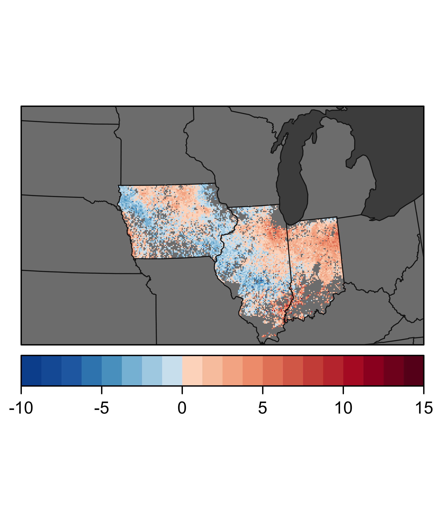
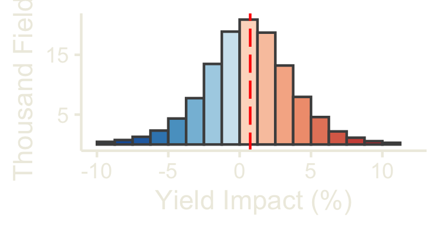
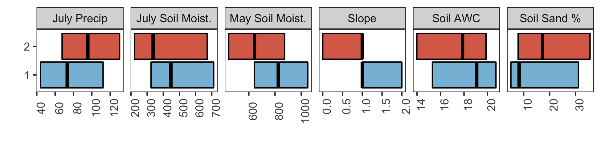

Goal: make Figure 3. Final multi-panel figure assembly done in Inkscape (not provided).


**R Packages Needed**


```r
library(tidyverse)
library(grf)
library(sf)


library(raster)
library(latticeExtra)
library(RColorBrewer)

library(here)

sessionInfo()
```

```
## R version 3.5.1 (2018-07-02)
## Platform: x86_64-apple-darwin15.6.0 (64-bit)
## Running under: macOS  10.14
## 
## Matrix products: default
## BLAS: /Library/Frameworks/R.framework/Versions/3.5/Resources/lib/libRblas.0.dylib
## LAPACK: /Library/Frameworks/R.framework/Versions/3.5/Resources/lib/libRlapack.dylib
## 
## locale:
## [1] en_US.UTF-8/en_US.UTF-8/en_US.UTF-8/C/en_US.UTF-8/en_US.UTF-8
## 
## attached base packages:
## [1] stats     graphics  grDevices utils     datasets  methods   base     
## 
## other attached packages:
##  [1] here_0.1            latticeExtra_0.6-28 RColorBrewer_1.1-2 
##  [4] lattice_0.20-35     raster_2.6-7        sp_1.3-1           
##  [7] sf_0.7-4            grf_0.10.2          forcats_0.3.0      
## [10] stringr_1.3.1       dplyr_0.8.0.1       purrr_0.2.5        
## [13] readr_1.1.1         tidyr_0.8.1         tibble_2.0.1       
## [16] ggplot2_3.2.0       tidyverse_1.2.1     knitr_1.20         
## 
## loaded via a namespace (and not attached):
##  [1] tidyselect_0.2.5 haven_1.1.2      colorspace_1.3-2 htmltools_0.3.6 
##  [5] yaml_2.2.0       rlang_0.3.1      e1071_1.7-0      pillar_1.3.1    
##  [9] glue_1.3.0       withr_2.1.2      DBI_1.0.0        modelr_0.1.2    
## [13] readxl_1.1.0     munsell_0.5.0    gtable_0.2.0     cellranger_1.1.0
## [17] rvest_0.3.2      evaluate_0.11    class_7.3-14     broom_0.5.0     
## [21] Rcpp_1.0.0       scales_1.0.0     backports_1.1.2  classInt_0.2-3  
## [25] jsonlite_1.6     hms_0.4.2        digest_0.6.16    stringi_1.2.4   
## [29] grid_3.5.1       rprojroot_1.3-2  cli_1.0.1        tools_3.5.1     
## [33] magrittr_1.5     lazyeval_0.2.1   crayon_1.3.4     pkgconfig_2.0.2 
## [37] Matrix_1.2-14    xml2_1.2.0       spData_0.2.9.3   lubridate_1.7.4 
## [41] assertthat_0.2.0 rmarkdown_1.10   httr_1.3.1       rstudioapi_0.7  
## [45] R6_2.2.2         units_0.6-1      nlme_3.1-137     compiler_3.5.1
```

# Directories


```r
# scratch folder for model rdata objects: corn causal forest (03.46)
soyScratchFolder <- paste0(here::here(),'/data/model_output/causalForest_soybean_Longterm')

# gis directory
gisFolder <- paste0(here::here(),'/data/gis')
```


# load model results
and calculate treatment effects as a percent of average yields


```r
# dataset
overlapSoy <- readRDS(paste0(soyScratchFolder, '/overlap.rds'))

Y_hatSoy <- readRDS(paste0(soyScratchFolder, '/Y_hat.rds'))
cfSoy <- readRDS(paste0(soyScratchFolder, '/cf_xc1.rds'))
varImpSoy <- readRDS(paste0(soyScratchFolder, '/cf_xc1_varImp.rds'))

# process results ------------------------------
# add predicted treatment effects to data 
constOob_predictSoy <- predict(cfSoy)

# add hats to original data frame
overlapW0Soy <- overlapSoy %>%
  bind_cols(data.frame(Y_hat = Y_hatSoy))

colVarsSoy <- varImpSoy %>% dplyr::pull(variable)

overlapWSoy <- overlapW0Soy %>%
    mutate_at(colVarsSoy, list(Q4 = ~ntile(., 4),
                           Q5 = ~ntile(., 5)))

overlapTauSoy <- overlapWSoy %>%
  bind_cols(constOob_predictSoy) 

ate_cf_aipwSoy = average_treatment_effect(cfSoy)
tauhat_rf_aipwSoy = c(ATE=ate_cf_aipwSoy["estimate"],
                   lower_ci=ate_cf_aipwSoy["estimate"] - 1.96 * ate_cf_aipwSoy["std.err"],
                   upper_ci=ate_cf_aipwSoy["estimate"] + 1.96 * ate_cf_aipwSoy["std.err"])
tauhat_rf_aipwSoy
```

```
##      ATE.estimate lower_ci.estimate upper_ci.estimate 
##        0.02427196        0.01729434        0.03124958
```

```r
# as a percentage of yield
meanYieldSoy <- mean(overlapTauSoy$Y)
meanYieldSoy
```

```
## [1] 3.283145
```

```r
tauhat_rf_aipw_percentSoy <- tauhat_rf_aipwSoy/meanYieldSoy * 100
tauhat_rf_aipw_percentSoy
```

```
##      ATE.estimate lower_ci.estimate upper_ci.estimate 
##         0.7392898         0.5267612         0.9518183
```

```r
# sampled in analysis
nrow(overlapTauSoy)
```

```
## [1] 119666
```

# Figure 2a: summary map

## map

### map vis parameters
for consistent mapping across figures


```r
panelBackground <- 'gray30'
stateLines <- 'gray10'
stateFill <- 'gray50'
mapXLim <- c(-480000,1310000)
mapYLim <- c(1570000,2630000)

colorbreaks <- 20

# scale range maize
palMin <- -10
palMax <- 15 

# blue and red color ramps pulled from color brewer (no white)
redRamp2 <- colorRampPalette(c('#fddbc7','#f4a582','#d6604d','#b2182b','#67001f'))
blueRamp2 <- colorRampPalette(rev(c('#d1e5f0','#92c5de','#4393c3','#2166ac','#08519c')))#'#053061')))

biPal <- c(blueRamp2(colorbreaks/5*2),redRamp2(colorbreaks/5*3))

# state outlines
states <- read_sf(paste0(gisFolder,'/States_continental.shp')) %>%
  st_transform(5070) 
statesStudy <- states %>%  filter(STATE_ABBR %in%             c('SD','MN','IA',"MO",'IL','WI','IN','MI','OH','ND','NE','KS', 'KY'))

states_spdf <- as(statesStudy, 'Spatial')
statesPlot <- as(states, 'Spatial')

# raster map
tauRas_soy <- raster(paste0(gisFolder, '/soybeans_summaryEffects.tif'))
```

### map


```r
spplot(tauRas_soy, col.regions = biPal, axes = TRUE,
       at=seq(palMin, palMax, (-palMin + palMax)/colorbreaks),
       colorkey = list(space = 'bottom'),
       maxpixels = 1500000,
       xlim = mapXLim, ylim = mapYLim,
       par.settings = list(panel.background = list(col=panelBackground))) +
  latticeExtra::layer(sp.polygons(statesPlot, lwd=.8, col=stateLines)) +
  latticeExtra::layer(sp.polygons(statesPlot, lwd=.8, col=NA, fill = stateFill), under=T)
```

<!-- -->

## Histogram scale


```r
# combine data
cates <- overlapTauSoy %>%
  mutate(tauPercents = predictions/meanYieldSoy*100,
         croptype = 'Soybeans') %>%
  dplyr::select(c(croptype, predictions, tauPercents, year)) 

# get ranges
cates %>%
  summarize(p5 = quantile(tauPercents, probs = c(0.05)),
            p95 = quantile(tauPercents, probs = c(0.95)))
```

```
## # A tibble: 1 x 2
##      p5   p95
##   <dbl> <dbl>
## 1 -4.74  5.76
```

```r
ggplot(cates %>% filter(croptype == 'Soybeans'),
       aes(x = tauPercents, fill = ..x..)) +
  geom_histogram(breaks = seq(palMin, palMax, (-palMin + palMax)/colorbreaks),
                 color = 'gray30') +
  xlim(-10,12)+
  scale_fill_gradientn(colors = biPal) +
  scale_y_continuous(breaks = c(5000,15000,25000), labels = c(5,  15, 25)) +
  xlab('Yield Impact (%)') +
  ylab('Thousand Fields') +
  #geom_vline(xintercept = 0, col = 'black', linetype = 'dashed') +
  geom_vline(xintercept = tauhat_rf_aipw_percentSoy[1], col = 'red', linetype = 'longdash') +
  theme_bw() + theme(panel.grid.major = element_blank(),
                      panel.grid.minor = element_blank(),
                       panel.background = element_rect(fill = "transparent",
                                                     colour = NA),
                     plot.background = element_rect(fill = "transparent",
                                                    colour = NA),
                     panel.border = element_blank(),
                     axis.text = element_text(color = '#EEECE1'),
                     axis.line = element_line(color = '#EEECE1'),
                     axis.title = element_text(color = '#EEECE1'),
                     axis.ticks = element_line(color = '#EEECE1'),
                     legend.position = 'none')
```

```
## Warning: Removed 801 rows containing non-finite values (stat_bin).
```

```
## Warning: Removed 3 rows containing missing values (geom_bar).
```

<!-- -->


# Figure 2b: covariates

## assign bins


```r
# bin cates
ateSoy <- tauhat_rf_aipwSoy[1]
overlapTau_1Soy <- overlapTauSoy %>%
  # code for positive or negative treatment effect
  mutate(cate_bin = case_when(predictions < 0 ~ 1,
                           predictions >= 0  ~ 2),
         cate_ntile = ntile(predictions, 5))

# variables to highligh
vars <- c('sandtotal_lay1_2', 'ppt_jul', 'tc_soilm_jul', 
                'tc_soilm_may', 'awc_lay1_2','slope')

varRenamerSoy <- data.frame(variable = vars,
         var2 = c('Soil Sand %','July Precip','July Soil Moist.',
                    'May Soil Moist.', 'Soil AWC', 'Slope'),
         stringsAsFactors = FALSE)  

hte_df <- overlapTau_1Soy %>%
  dplyr::select(c(pointID, year, predictions, cate_bin, vars)) %>%
  tidyr::gather(., key = variable, value = value, vars)

# calculate IQR by bins
hte_iqr <- hte_df %>% 
  mutate(cate_bin = as.factor(cate_bin)) %>%
  dplyr::group_by(variable, cate_bin) %>%
  dplyr::summarize(mean = mean(value, na.rm=TRUE),
            stdev = sd(value, na.rm=TRUE),
            iqr_25 = quantile(value, probs = 0.25, na.rm=TRUE),
            iqr_50 = quantile(value, probs = 0.5, na.rm=TRUE),
            iqr_75 = quantile(value, probs = 0.75, na.rm=TRUE)) %>%
  left_join(varRenamerSoy, by = 'variable')
```

## manuscript boxplots


```r
catePalette <- c("#86BDDA","#DB6C56")

ggplot(hte_iqr,
       aes(x = cate_bin, y = value, group = cate_bin, fill = cate_bin)) +
  geom_crossbar(aes(y = iqr_50, ymin = iqr_25, ymax = iqr_75)) +
  scale_fill_manual(values = catePalette) +
 # xlab('') + 
  ylab('') + xlab('') + 
  facet_wrap(~var2, scales = 'free_x',nrow = 1) +
  coord_flip() +
  theme_bw() + theme(legend.position = 'none',
                      panel.grid.major = element_blank(),
                      panel.grid.minor = element_blank(),
                      axis.text.x = element_text(angle = 90))
```

<!-- -->

```r
                      #strip.background = element_blank(),
                      #strip.text.x = element_blank())
```


