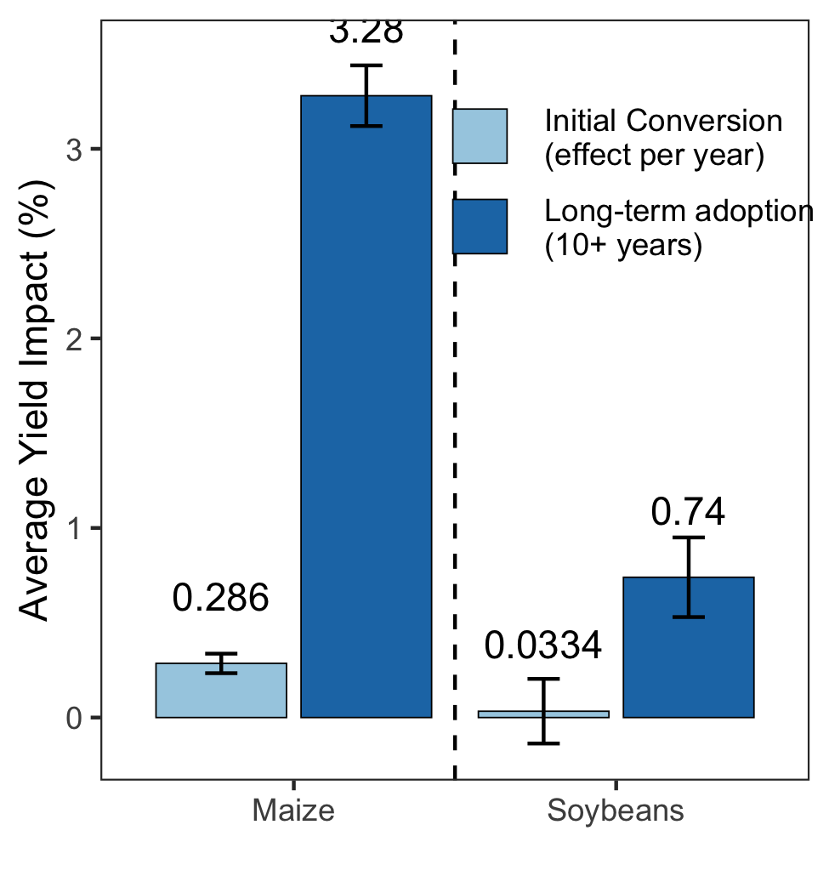

Goal: make Figure 4. Labels adjusted in Inkscape (not provided).


**R Packages Needed**


```r
library(tidyverse)
```

```
## Warning: package 'ggplot2' was built under R version 3.5.2
```

```
## Warning: package 'tibble' was built under R version 3.5.2
```

```
## Warning: package 'dplyr' was built under R version 3.5.2
```

```r
sessionInfo()
```

```
## R version 3.5.1 (2018-07-02)
## Platform: x86_64-apple-darwin15.6.0 (64-bit)
## Running under: macOS  10.14
## 
## Matrix products: default
## BLAS: /Library/Frameworks/R.framework/Versions/3.5/Resources/lib/libRblas.0.dylib
## LAPACK: /Library/Frameworks/R.framework/Versions/3.5/Resources/lib/libRlapack.dylib
## 
## locale:
## [1] en_US.UTF-8/en_US.UTF-8/en_US.UTF-8/C/en_US.UTF-8/en_US.UTF-8
## 
## attached base packages:
## [1] stats     graphics  grDevices utils     datasets  methods   base     
## 
## other attached packages:
##  [1] forcats_0.3.0   stringr_1.3.1   dplyr_0.8.0.1   purrr_0.2.5    
##  [5] readr_1.1.1     tidyr_0.8.1     tibble_2.0.1    ggplot2_3.2.0  
##  [9] tidyverse_1.2.1 knitr_1.20     
## 
## loaded via a namespace (and not attached):
##  [1] Rcpp_1.0.0       cellranger_1.1.0 pillar_1.3.1     compiler_3.5.1  
##  [5] tools_3.5.1      digest_0.6.16    lubridate_1.7.4  jsonlite_1.6    
##  [9] evaluate_0.11    nlme_3.1-137     gtable_0.2.0     lattice_0.20-35 
## [13] pkgconfig_2.0.2  rlang_0.3.1      cli_1.0.1        rstudioapi_0.7  
## [17] yaml_2.2.0       haven_1.1.2      withr_2.1.2      xml2_1.2.0      
## [21] httr_1.3.1       hms_0.4.2        rprojroot_1.3-2  grid_3.5.1      
## [25] tidyselect_0.2.5 glue_1.3.0       R6_2.2.2         readxl_1.1.0    
## [29] rmarkdown_1.10   modelr_0.1.2     magrittr_1.5     backports_1.1.2 
## [33] scales_1.0.0     htmltools_0.3.6  rvest_0.3.2      assertthat_0.2.0
## [37] colorspace_1.3-2 stringi_1.2.4    lazyeval_0.2.1   munsell_0.5.0   
## [41] broom_0.5.0      crayon_1.3.4
```

# Make Data Frame
constant tillage numbers taken from 03.20 and 03.30 (maize and soy results)

maize switch numbers taken from 01.10 and 01.20
soy switch numbers taken from 02.10 and 02.20

...didn't automate


```r
ates <- data.frame(analysis = c('Long-term adoption\n(10+ years)',
                                'Long-term adoption\n(10+ years)',
                                'Initial Conversion\n(effect per year)',
                                'Switch to Conventional',
                                 'Initial Conversion\n(effect per year)',
                                'Switch to Conventional'),
                   croptype = c('Maize','Soybeans',
                                'Maize','Maize',
                                'Soybeans','Soybeans'),
                   ate = c(0.355, 0.024, 0.0341, 0.0318, 0.0012, 0.0215),
                   ate_upper = c(0.373, 0.031, 0.0403, 0.0419, 0.0073, 0.0278),
                   ate_lower = c(0.338, 0.0291, 0.0279, 0.0218, -0.00489, 0.0153),
                   ate_perc = c(3.28, 0.74, 0.286, 0.268, 0.0334, 0.61),
                   ate_upper_perc = c(3.44, 0.95, 0.337, 0.353, 0.204, 0.787),
                   ate_lower_perc = c(3.12, 0.53, 0.234, 0.183, -0.137,0.433),
                   stringsAsFactors = FALSE)
```

helper function for legend spacing


```r
# function to increase vertical spacing between legend keys
# @clauswilke
draw_key_polygon3 <- function(data, params, size) {
  lwd <- min(data$size, min(size) / 4)

  grid::rectGrob(
    width = grid::unit(0.6, "npc"),
    height = grid::unit(0.6, "npc"),
    gp = grid::gpar(
      col = data$colour,
      fill = alpha(data$fill, data$alpha),
      lty = data$linetype,
      lwd = lwd * .pt,
      linejoin = "mitre"
    ))
}

# register new key drawing function, 
# the effect is global & persistent throughout the R session
GeomBar$draw_key = draw_key_polygon3
```


```r
ggplot(ates %>% filter(analysis != 'Switch to Conventional'),
       aes(x = croptype, y = ate_perc, ymin = ate_lower_perc, ymax = ate_upper_perc,
           fill = analysis, group = interaction(analysis,croptype))) +
  ylab('Average Yield Impact (%)') + xlab('') +
  scale_fill_manual(values = rev(c('#1f78b4','#a6cee3'))) + #,'#fdbf6f')) + 
  geom_bar(stat='identity', position = position_dodge2(), 
           color = 'black', size = .2) +
  ylim(c(-.15,3.5)) +
  geom_errorbar(position = position_dodge(width = 0.9), width = .2) +
  geom_text(aes(label = ate_perc), position = position_dodge(width = .9),vjust = -1.9) +
  geom_vline(xintercept = 1.5, linetype = 'dashed') +
  theme_bw() + theme(legend.title = element_blank(),
                     panel.grid = element_blank(),
                     legend.key = element_rect(color = NA, fill = NA),
                     legend.key.size =unit(.9, 'cm'),
                     legend.background = element_blank(),
                     #legend.position = 'top')
                    legend.position = c(.75, .8))
```

<!-- -->


